Instalace a základní konfigurace
================================

Popis
-----

V rámci tohoto školení se seznámíme se základní instalací
nástroje. Instalace je možná pomocí instalátoru, což je pro účely
školení nejvhodnější forma. Instalace vyžaduje JRE
(:wikipedia-en:`Java virtual machine`) verze 1.8. Pokud chce uživatel
provádět i zásahy do programového kódu na úrovni tříd jazyka Java
potřebuje JDK (:wikipedia-en:`Java Development Kit`) verze
1.8. Většina zásahů však nevyžaduje programování s využitím jazyka
:wikipedia:`Java <Java (programovací jazyk)>`, ale s využitími zejména
jazyků :wikipedia:`XML` a :wikipedia:`XSLT`.  Instalace je možná také
s využitím archiv :wikipedia:`WAR <WAR (file format)>`, zde je však
nutná existence (instalace) servlet kontejneru
např. :wikipedia:`Apache Tomcat` nebo :wikipedia-en:`JBoss <JBoss
Enterprise Application Platform>`. Instalace je také možná ze
zdrojových kódů. Samotná instalace je poměrně triviální, ale může se
na některých konfiguracích vyskytnout několik problémů, např. s
alokací paměti. V rámci instalace je možní instalovat i integrovaný
GeoServer (viz školení :skoleni:`GeoServer pro začátečníky
<geoserver-zacatecnik>`). V rámci instalace je možné přidat podporu
pro :wikipedia:`INSPIRE` a pod. Konfigurace pak zahrnuje zejména
instalaci šablon pro editaci metadat a vytvoření uživatelů a skupin
uživatelů a nastavení přístupových práv. Dále je vhodné v základní
konfiguraci nastavit metadata na úrovni popisu katalogu.

Stažení a instalace
-------------------

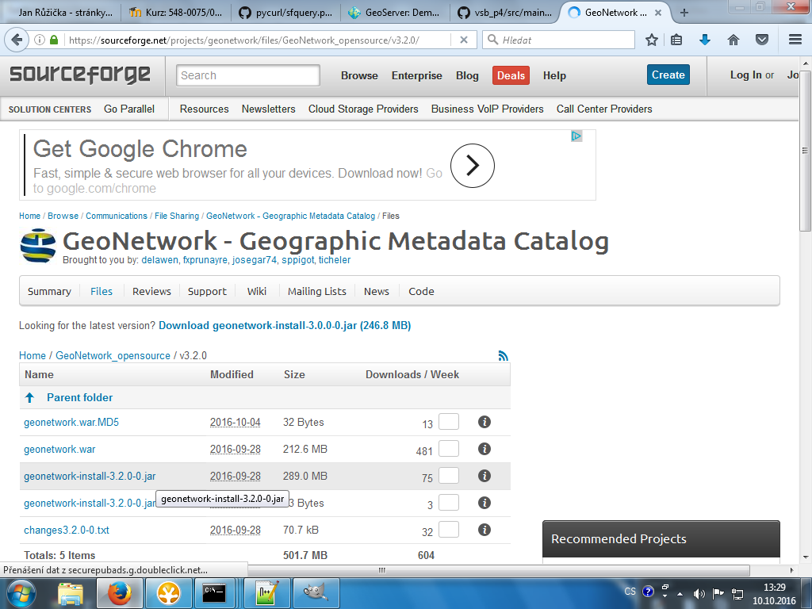

   Stažení GeoNetwork OpenSource.

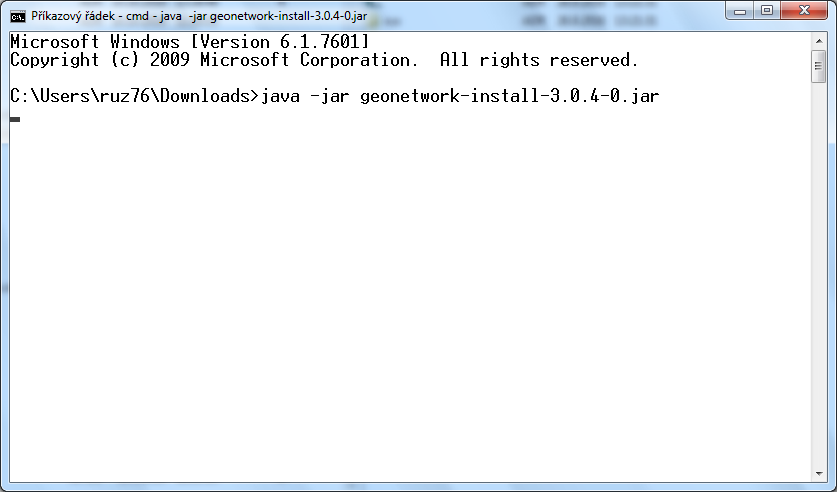

   Spuštění instalace z příkazové řádky.

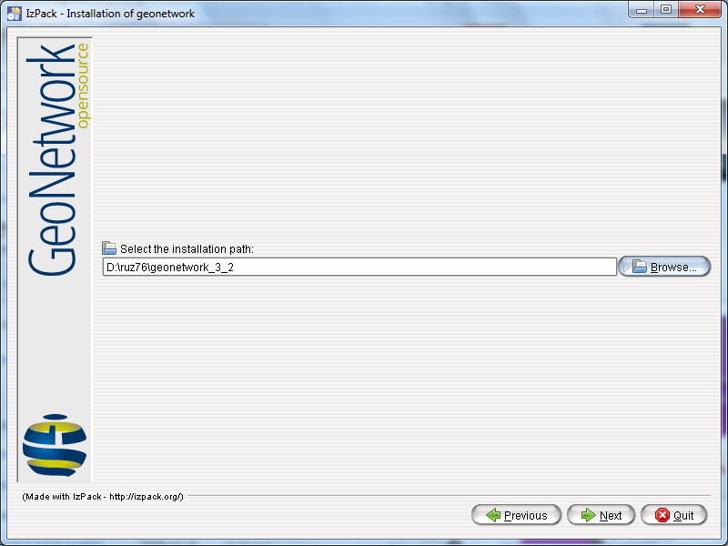

   Instalace, volba adresáře.

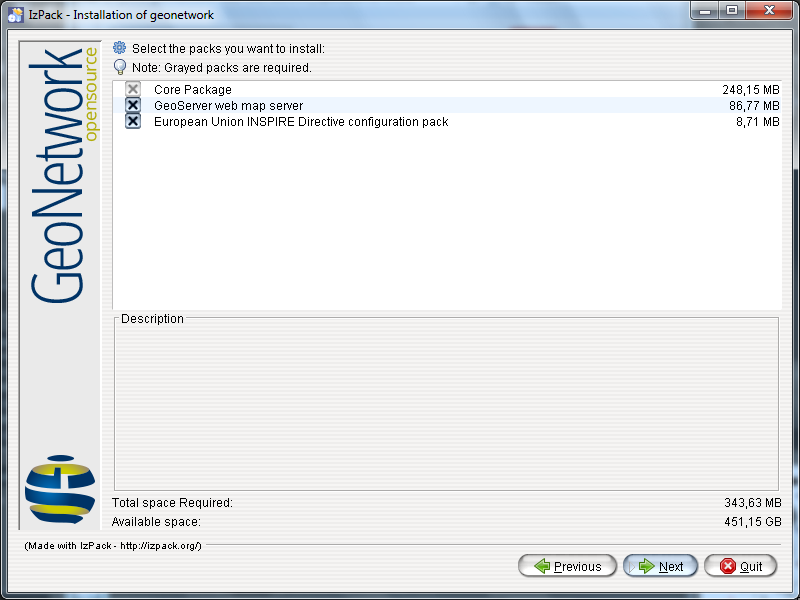

   Dokončení instalace, volba podpory.

Podpora INSPIRE
---------------   

Balík INSPIRE obsahuje číselníky. Po ověření instalace se zdá, že
balík obsahuje i schematron pro validaci. Ale např. šablona pro službu
dle :wikipedia:`INSPIRE` (Infrastructure for Spatial Information in
the European Community) je součástí Core instalace, tj. přímo v jádru
systému. Tento balíček jej aktivuje.

.. tip:: Více o INSPIRE v rámci školení :skoleni:`Úvod do GIS
         <open-source-gis/standardy/inspire.html>`.
         
Problémy s instalací
^^^^^^^^^^^^^^^^^^^^

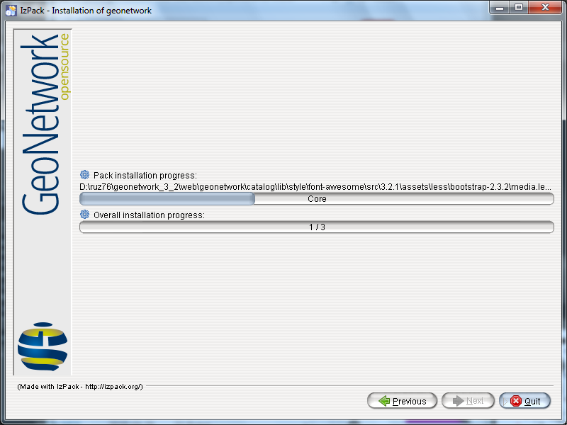
            
   V první fázi obvykle problémy nebývají.

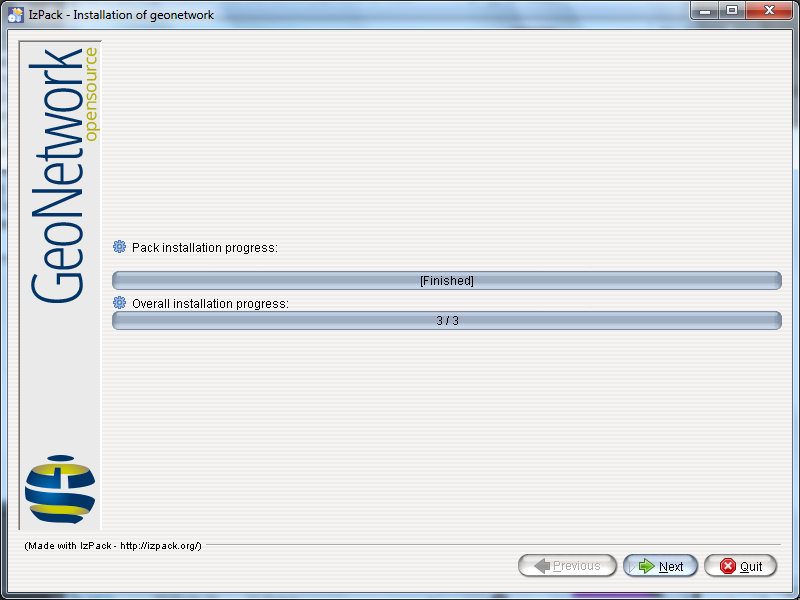
            
   Po třetí fázi se někdy instalátor zasekne, ale to obvykle nevadí,
   stačí okno zavřít.

Spuštění
--------

Spuštění se realizuje přes ``bin/startup.bat`` (startup.sh) soubor.

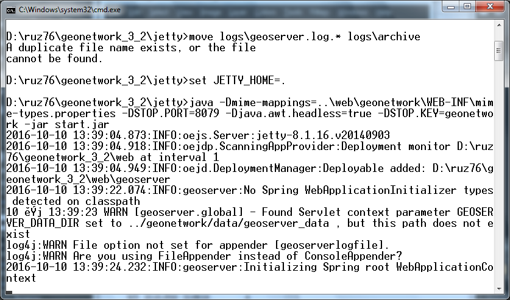

   Spuštění GeoNetwork.
   
Pokud start skončí tak jako na následujícím obrázku je velká šance, že
GeoNetwork běží. Hledejte SelectChannelConnector@0.0.0.0:8080

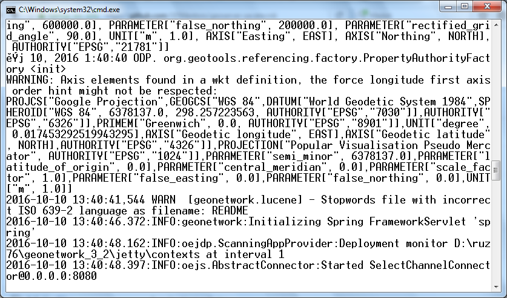

   Běžící instalace GeoNetwork.

Address in use
^^^^^^^^^^^^^^

Obvyklou chybou při startu je nemožnost naslouchat na portu 8080. V
takovém případě je potřeba GeoNetwork resp. Jetty kontejner
přesměrovat na jiný port. Toto se realizuje v souboru
``jetty/etc/jetty-http.xml`` přepsáním čísla 8080 na jiné číslo
např. 9080.

Přístup z webového prohlížeče
-----------------------------

Zadáním adresy *http://localhost:8080/geonetwork/* by se mělo aktivovat
webové GUI pro GeoNetwork.

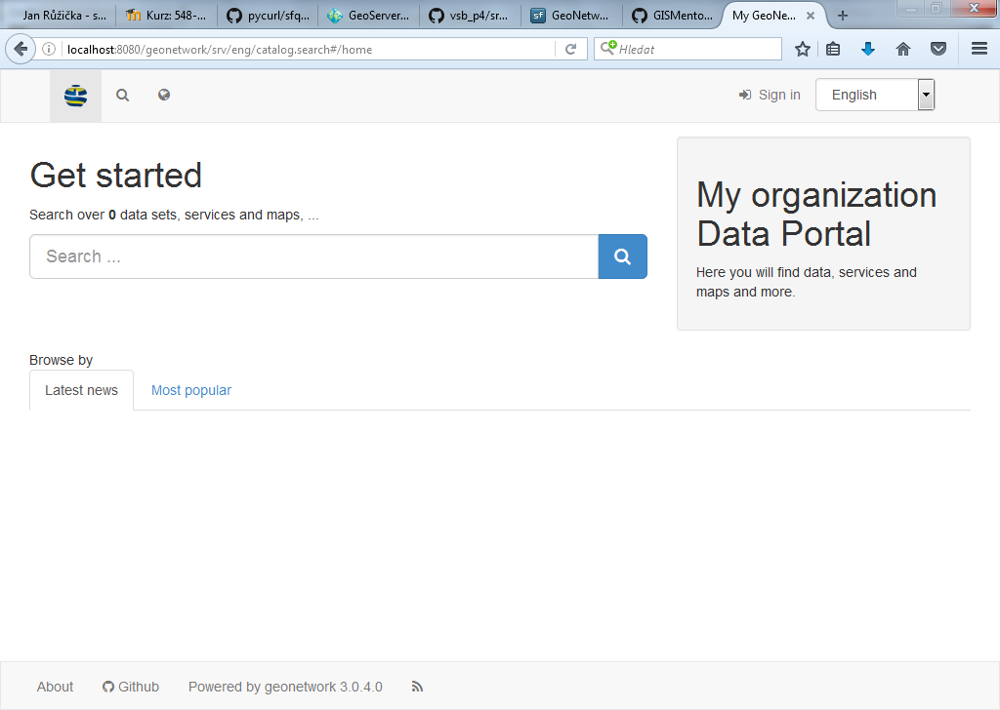

   Úvodní stránka webového GUI.

Admin konzole
^^^^^^^^^^^^^

Pro aktivaci admin konzole je nutné se přihlásit. Uživatel je `admin` a
heslo je `admin`.

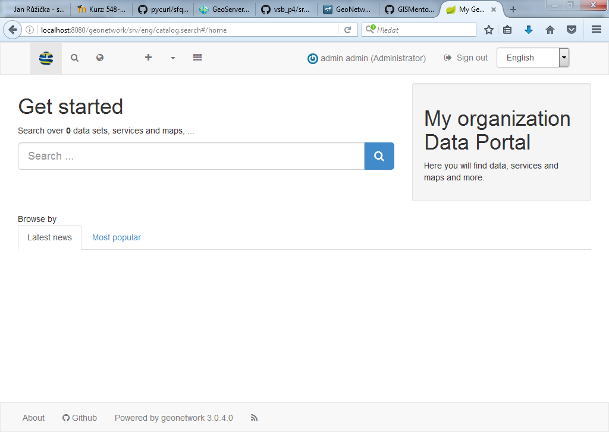

   Konzole je dostupná v hlavním menu.

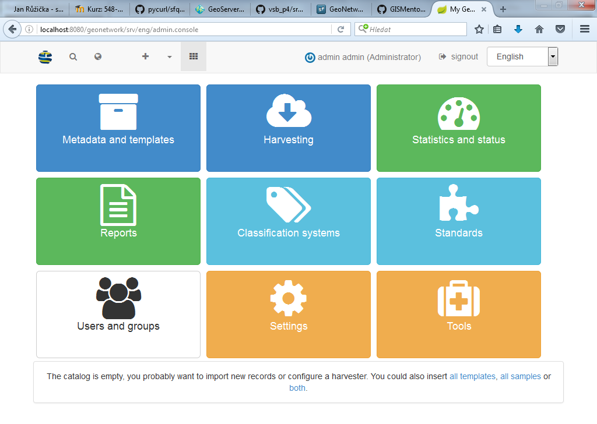

   Konzole administrátora.

Šablony
-------

K dispozici je několik šablon pro editaci metadat. Pěkné na GeoNetwork
je, že každý záznam se může stát také šablonou, ale musí vycházet z
jiné šablony. Vytvoření úplně nové šablony nevycházející z již
existující šablony je možné, ale nikoli triviální.

Instalace šablon a příkladů
^^^^^^^^^^^^^^^^^^^^^^^^^^^

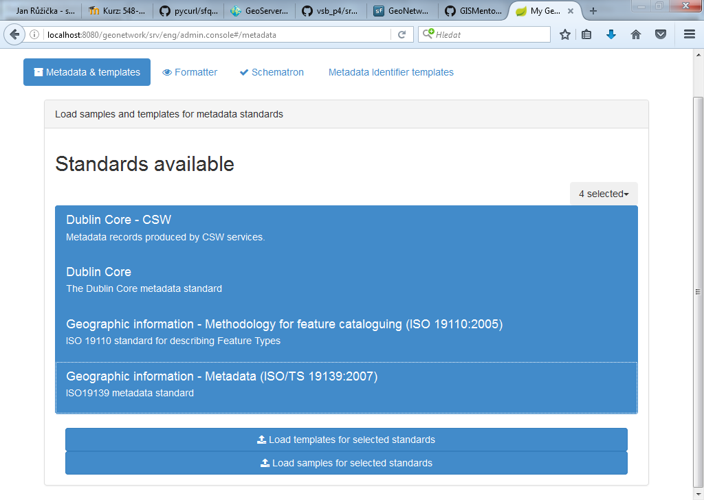

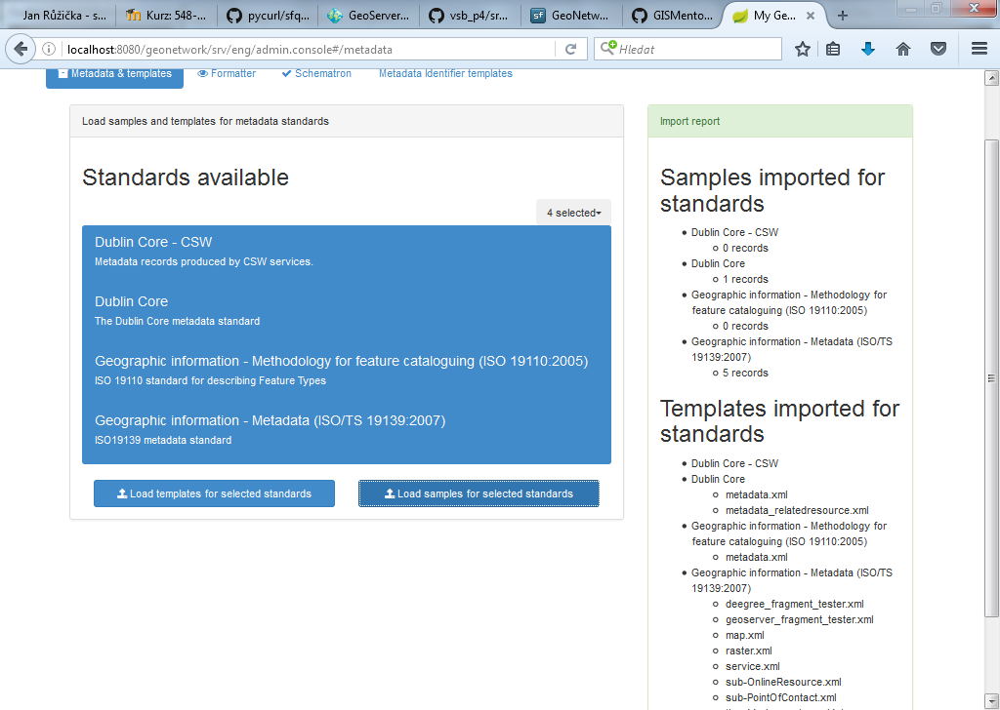

   Seznam dostupných šablon k instalaci.

Dataset
^^^^^^^

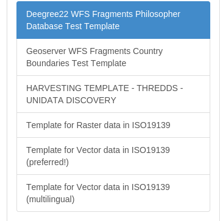

Feature catalog
^^^^^^^^^^^^^^^

K dispozici pouze jedna šablona pro tvorbu katalogu geoprvků.

Map
^^^

K dispozici pouze jedna šablona pro tvorbu metadat mapy.

Service
^^^^^^^

K dispozici jsou dvě šablony. Šablona INSPIRE SDS umožňuje výběr dle
klasifikace INSPIRE a zadání výsledku conformance testu. Druhá šablona
je základní pro ISO 19119/19139.

Others
^^^^^^

Další šablony jsou pro standard :wikipedia:`Dublin Core`, kterým je
možné popsat obecný zdroj.
