Editace metadat dle ISO 19115 (ISO 19119)
=========================================

Seznámíme se s editací (vytvářením) metadat pro popis dat a služeb
(případně map nebo jiných typů dokumentů). Tutoriál zahrnuje vytvoření
popisu pro jednu datovou sadu a jednu službu s tím, že se detailně
projdou všechny položky, které je možné definovat. Součástí nástroje
je možné vytvořená metadata ukládat jako nové šablony, které pak mohou
další uživatelé využívat pro popis dalších zdrojů. Ukážeme si jak
spravovat šablony pro vytváření metadat.

Uživatelé a skupiny
-------------------

Je možné vytvářet uživatele a skupiny uživatelů.

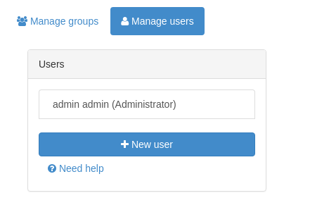
           
Každého uživatele je možné zařadit v různých rolích do různých
skupin. Případně je možné nastavit uživatele jakožto administrátora.

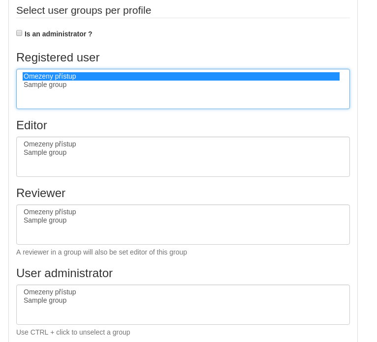

Ke každému záznamu je možné nastavit následující přístupová práva. K
nastavení se dostaneme přes Contribute (bez výběru podmnožiny).

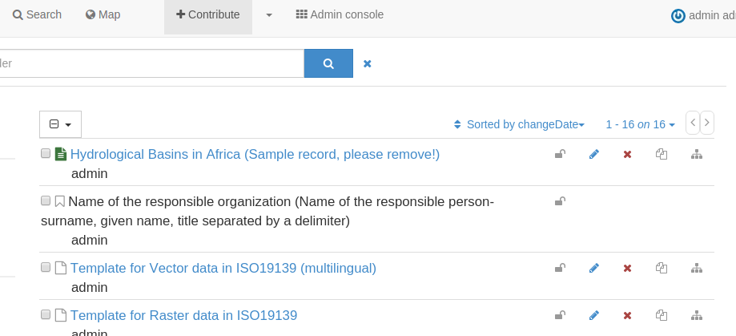

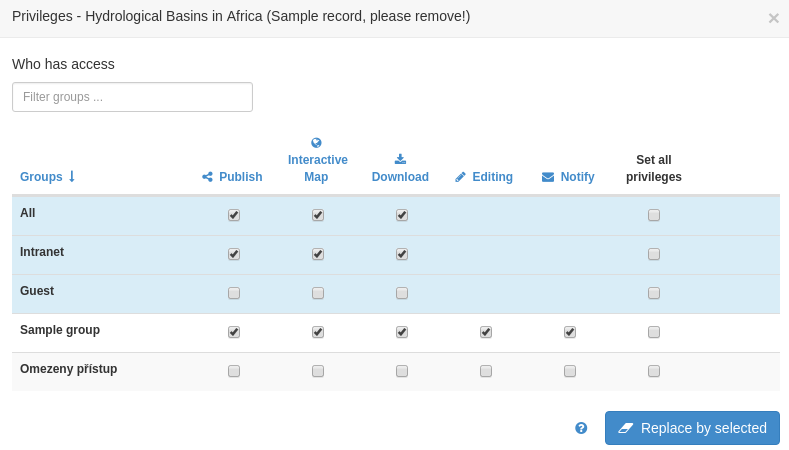

Veřejné a neveřejné záznamy
---------------------------

Přístup je možné řešit s využitím skupin a práv k záznamům.

Neveřejná sekce pro editory
^^^^^^^^^^^^^^^^^^^^^^^^^^^

Prakticky lze řešit na úrovni :wikipedia:`XSLT`, která načítá šablonu
a řadí sekce dle potřeby.

Popis aplikací, negrafických a nestrukturovaných dat
----------------------------------------------------

Je to možné na úrovni :wikipedia:`Dublin Core` a přiřazení záznamu do
kategorie. Jinak by se musela nachystat šablona, pro popis.

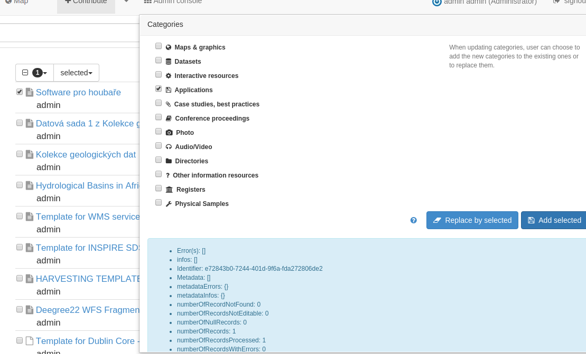

Hierarchie
----------

K dispozici je přidání vazby na rodiče, službu, datovou sadu, feature
catalog, jiný zdroj (tedy třeba i v aplikaci) a dokument.

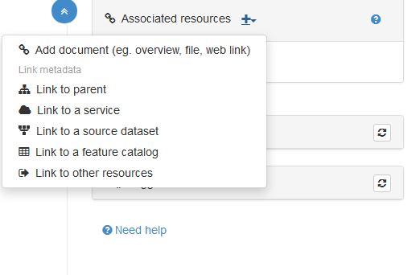
           
K dispozici je následující pohled pro hiearchii data-služba-aplikace
(n:n) u záznamu v každé této úrovni.

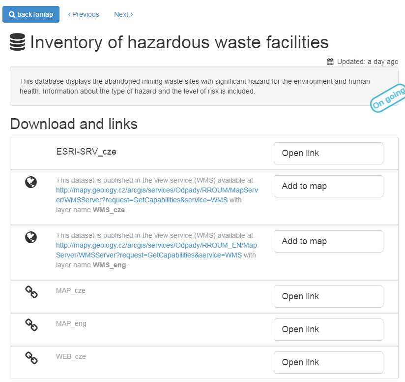

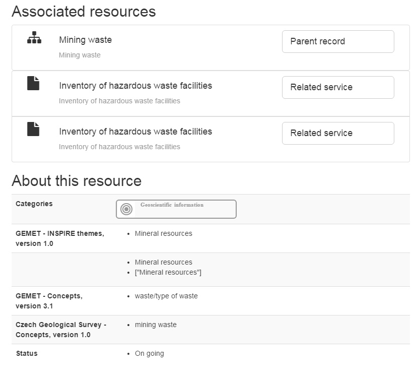

Popis sérií (dlaždic)
---------------------

Vychází se z ISO 19115 (19139). Vytvoříme mateřský popis, kde budou
obecná metadata pro celou sérii a pak vytváříme potomky tohoto popisu.
           
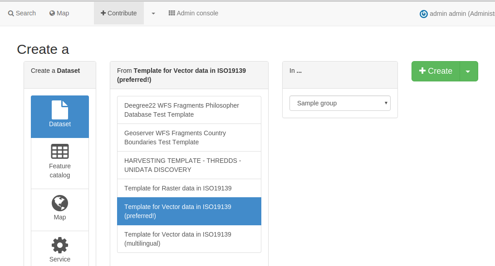

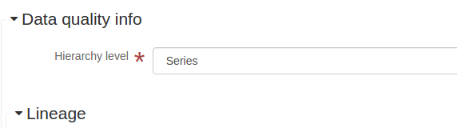

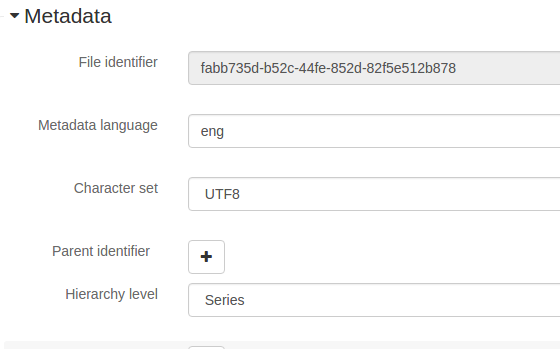

Pak můžeme vytvářet potomky tohoto popisu.

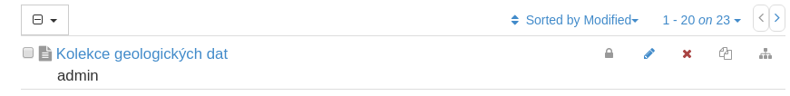

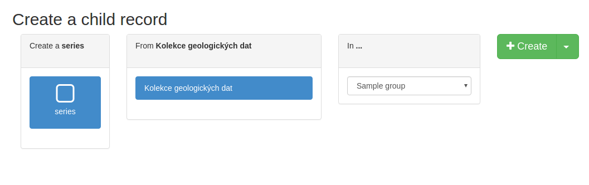

Popis se nám zkopíruje z rodiče a můžeme přepsat některé prvky.

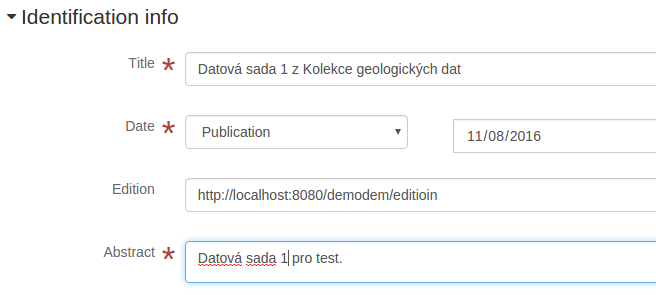

Např. Extent.
            
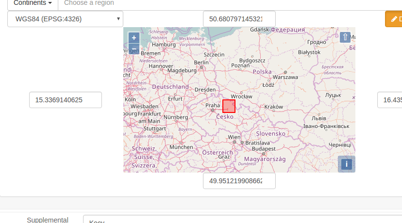

Nebo informaci o kvalitě.

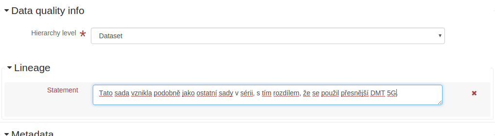

Pak přidáme vazbu na rodiče.

.. figure:: images/dataset-parents.png
   :class: small

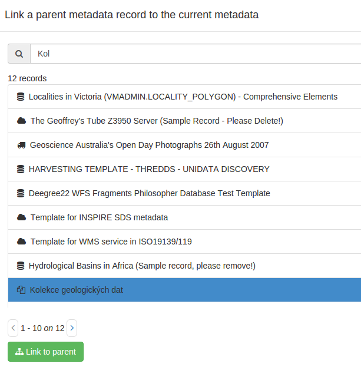

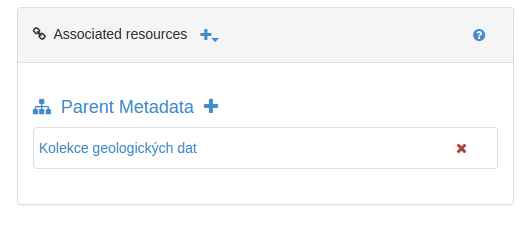

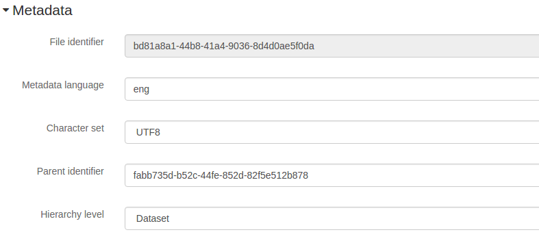

A ta se projeví i u rodiče v seznamu asociovaných zdrojů.

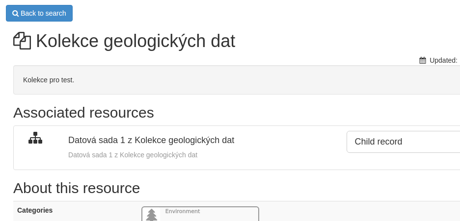

Při změně u rodiče nedojde automaticky ke změně u potomka. Pokud je
změna nutná (např.) změna u kontaktního místa je nutné použít *Batch
update*.

Batch update
------------

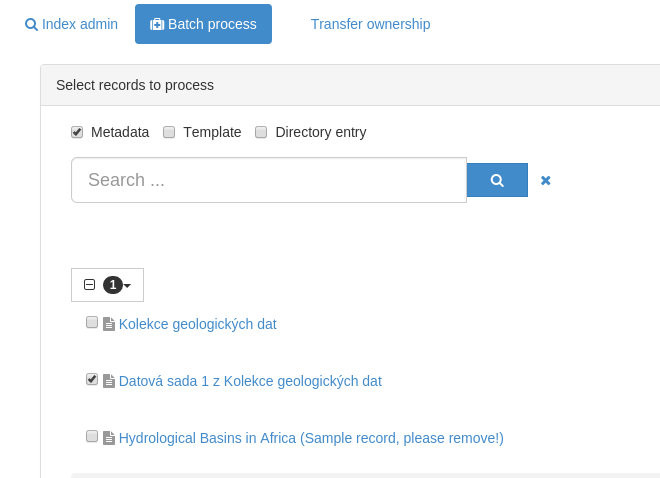
           
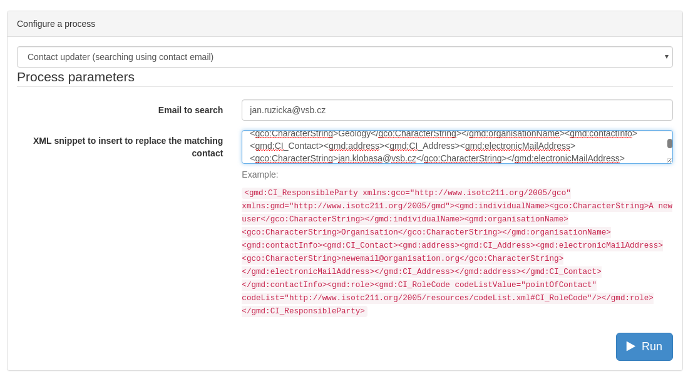

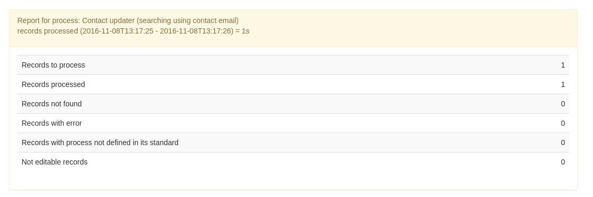

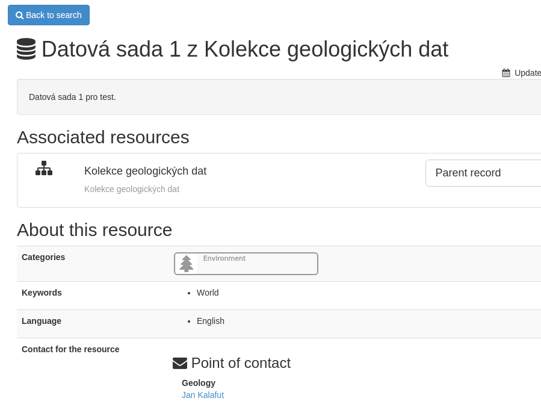
            
Vícejazyčná metadata
--------------------

Vícejazyčná metadata pořizovat lze i když ne vždy bez problémů. Občas
končil GeoNetwork chybou. K dispozici je šablona, která toto umožňuje. 

.. todo:: Zatím však nevím jak tam třeba přidat češtinu.

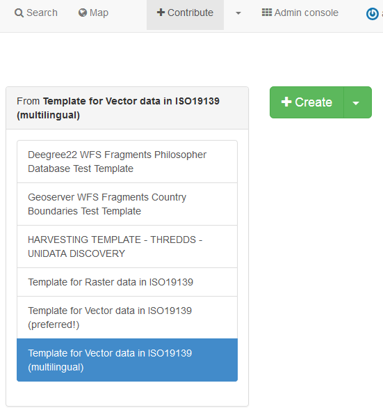
