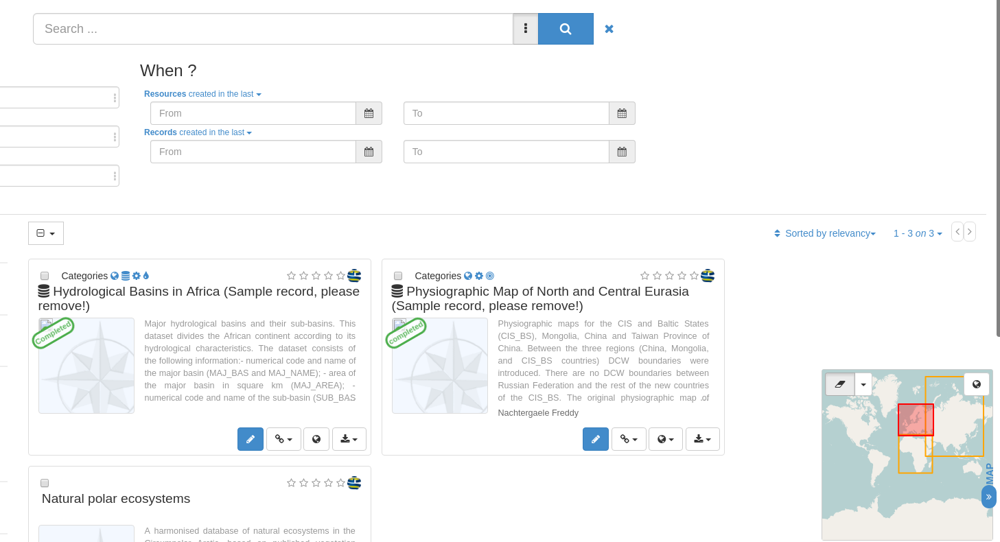

Hledání v metadatech
====================

Součástí je prohlížení metadat a přidávání dat do mapy. Vyzkoušíme
všechny různé nástroje pro hledání dostupné přes webové rozhraní
nástroje.

Vyhledávání podle mapy
----------------------

Vyhledávání podle mapy je možné realizovat v okně mapy, kde je možné
nakreslit obdélník a tak aplikovat prostorový dotaz na již nalezené
objekty. Na výběr jsou dvě prostorové operace: *intersect* a *within*.

           
   Vyhledání metadata podle mapy.
